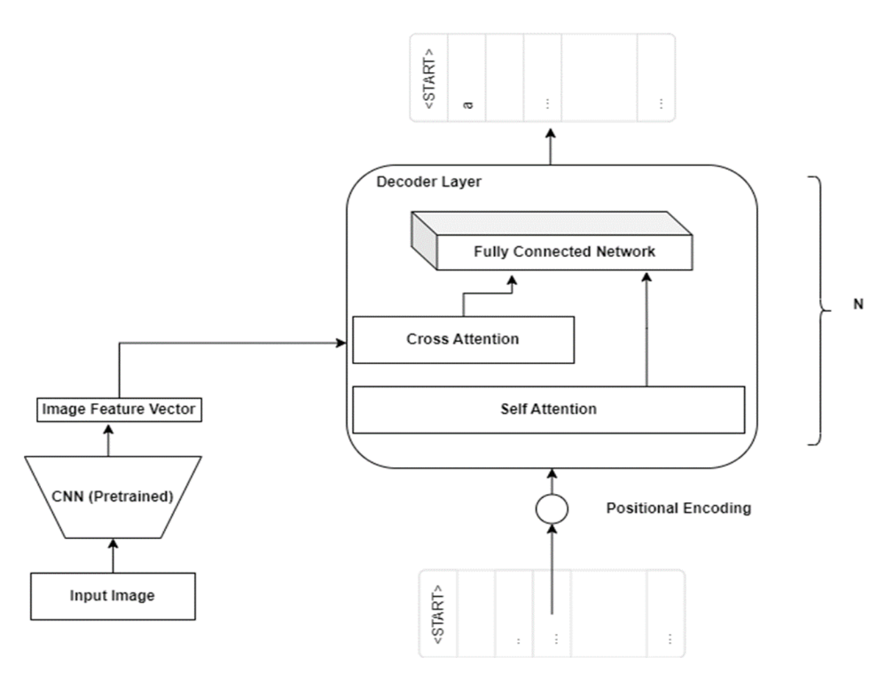
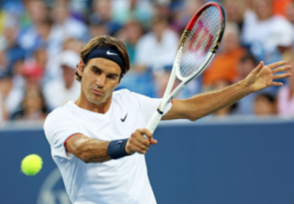

# iCap

The goal of this project was to create and train a neural network model to generate captions for images. 
Most methods in this domain utilize Convlutional Neural Networka to extract feature maps from images and a sequence network to generate the sentence using the feature map. Three models have been tested for this application.
- Show and Tell (CNN - LSTM) [1] 
- CNN - Transformer
- Meshed Transformer [2]

## 2. Image caption generator with transformer

For this model we used 5 decoder layers.

### Model Architecture



### Datasets

This model uses [COCO dataset](https://cocodataset.org/).

Download and unzip dataset to `coco_dataset` directory:

```sh
mkdir coco_dataset

wget -O coco_dataset/train2014.zip http://images.cocodataset.org/zips/train2014.zip
unzip 'coco_dataset/train2014.zip'
rm -r 'coco_dataset/train2014.zip'

wget -O coco_dataset/val2014.zip http://images.cocodataset.org/zips/val2014.zip
unzip 'coco_dataset/val2014.zip'
rm -r 'coco_dataset/val2014.zip'

wget -O coco_dataset/caption_datasets.zip http://cs.stanford.edu/people/karpathy/deepimagesent/caption_datasets.zip
unzip 'coco_dataset/caption_datasets.zip'
rm -r 'coco_dataset/caption_datasets.zip'
```

### Setup

Create a virtual environment and install dependencies in it.

```
virtualenv venv --python=/usr/bin/python3
source venv/bin/activate
pip install -r requirements.txt
```

### Run

To run the transformer:
```
cd cnn_transformer
python transformer.py
```

### Sample captions generated by the model:


> a tennis player swinging a tennis racquet on a tennis court with a racket


> two tall buildings in the water with a clock in the background


## 3. M2 transformer
### Environment setup

The concerned files are in the m2_transformer folder. Create the `m2release` conda environment using the `environment.yml` file.

Download spacy data by executing the following command:
```
python -m spacy download en
```
## Data preparation

Download the COCO annotations file [annotations.zip](https://drive.google.com/file/d/1i8mqKFKhqvBr8kEp3DbIh9-9UNAfKGmE/view?usp=sharing) and extract it.

Detection features are computed from feature representations of Faster RCNN object detectiions. To obtain precomputed feature representations of COCO dataset, download the COCO features file [coco_detections.hdf5](https://drive.google.com/open?id=1MV6dSnqViQfyvgyHrmAT_lLpFbkzp3mx) (~53.5 GB), in which detections of each image are stored under the `<image_id>_features` key. `<image_id>` is the id of each COCO image, without leading zeros.

## Run code
Run `python train.py` or `python test.py` with respective arguments to train or test model. Pretrained model is available at https://drive.google.com/file/d/1tPFbzfmPp56mrRE43BweJD7CzP5w5pxl/view?usp=share_link

Use `python custom.py` to test model on specific images of COCO dataset


## BLEU-3 Score

| SN  | Model                                   | BLEU-3 |
|-----|-----------------------------------------|--------|
|  1  | CNN + LSTM                              | 14.5%  |
|  2  | **CNN + Transformer**                   | 20.7%  |
|  3  | Faster RCNN + Meshed Memory Transformer | 28.3%  |

# References

[1] Vinyals, Oriol, Alexander Toshev, Samy Bengio, and Dumitru Erhan. "Show and tell: A neural image caption generator." In Proceedings of the IEEE conference on computer vision and pattern recognition, pp. 3156-3164. 2015.

[2] Cornia, Marcella, Matteo Stefanini, Lorenzo Baraldi, and Rita Cucchiara. "Meshed-memory transformer for image captioning." In Proceedings of the IEEE/CVF conference on computer vision and pattern recognition, pp. 10578-10587. 2020.
